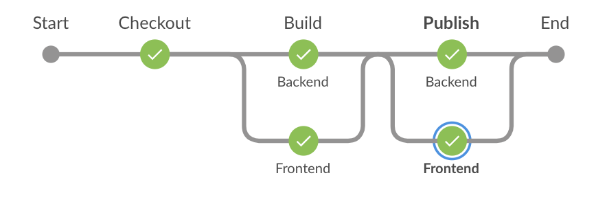

# CompanyNews Application

### Building app on local

To build the application on local machine run following command
```
cd docker
./build.sh
```

To start and stop the application scripts ([run.sh](docker/run.sh) & [stop.sh](docker/stop.sh)) are also present in [docker](docker) folder.

Go to [https://localhost](https://localhost) to access to application

### Build Company News Application on Jenkins

On every commit to master build job will be triggered on Jenkins ([Jenkinsfile](Jenkinsfile)) which will push the docker images of frontend and backend to docker repository.

For assignment purpose I used Dockerhub but in the actual environment, we can set up a local docker registry or private Dockerhub registry.

<p align="center">
  
</p>




### Build/Run for the developer machine

Developers can use gradle docker plugin to create docker images on local and test their code on local with docker.

### Running Application on UAT

For running application on UAT we can use docker swarm ([Compose file](docker-swarm/docker-compose.yaml) for same is also part of the project)

```
cd docker-swarm
./run.sh
```
if you want to create your own docker swarm cluster using docker-machine, we have scripts available in [docker-swarm](docker-swarm) folder for same.

Use [swarm-cluster-create.sh](docker-swarm/swarm-cluster-create.sh) to create cluster and [swarm-cluster-remove.sh](docker-swarm/swarm-cluster-remove.sh) for cleanup.

### Running the application on Prod

* Openshift
* AWS ECS/EKS with fargate and automate the whole process using terraform

### Improvements

* Dev team has to figure out a way to provide a configuration by which we can define location of prelayer persistence file. Then we can use docker volume to share file in docker swarm environment.

* Right now certificates are embedded in docker image for this assignment purposes we  can provide certificate at runtime using volume as well.

### Running Application

<p align="center">
  
</p>
<p align="center">
  
</p>
<p align="center">
  
</p>
<p align="center">
  
</p>
